## Cisco Networking Basics - Progress Summary

| Module | Score |
|------|-------|
| Module 1 | 82% |
| Module 2 | 80% |
| Module 3 | 73% |
| Module 4 | 90% |
| Checkpoint Exam 1 | 85% |
| Module 5 | 70% |
| Module 6 | 100% |
| Module 7 | 100% |
| Checkpoint Exam 2 | 71% |
| Module 8 | 73% |
| Module 9 | 73% |
| Module 10 | 91% |
| Module 11 | 82% |
| Checkpoint Exam 3 | 90% |
| Module 12 | 91% |
| Module 13 | 83% |
| Module 14 | 75% |
| Checkpoint Exam 4 | 95% |
| Module 15 | 82% |
| Module 16 | 91% |
| Module 17 | 91% |

---

## Areas Needing Improvement
Focus areas are based on incorrectly answered questions captured below.  
Each screenshot includes:
- the original question  
- the incorrect answer selected  
- the corrected explanation  

---

## Module 1 — 82%
  
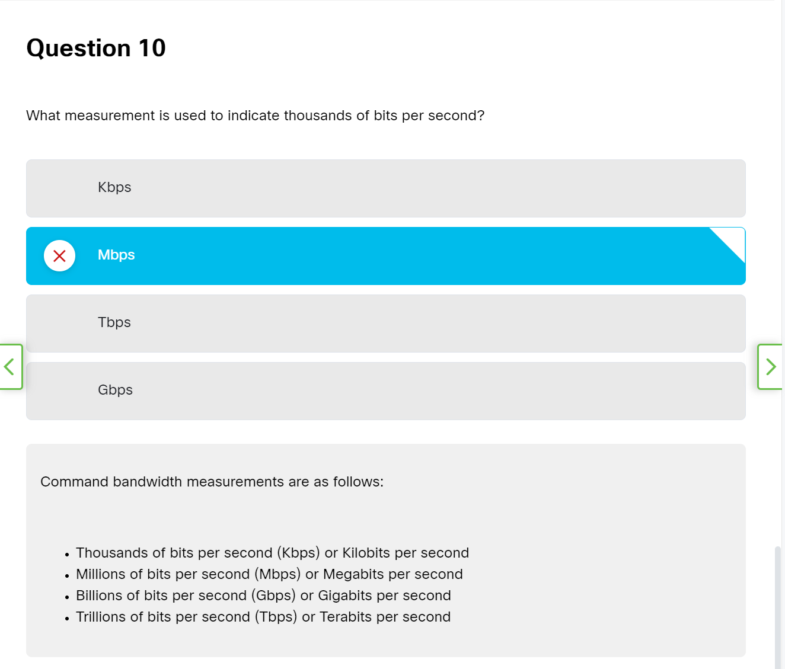

---

## Module 2 — 80%
  

---

## Module 3 — 73%
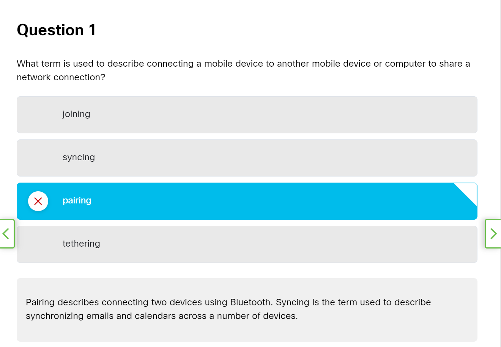  
  

---

## Module 4 — 90%

---

## Checkpoint Exam: Build a small network — 85%

---

## Module 5 — 70%
  
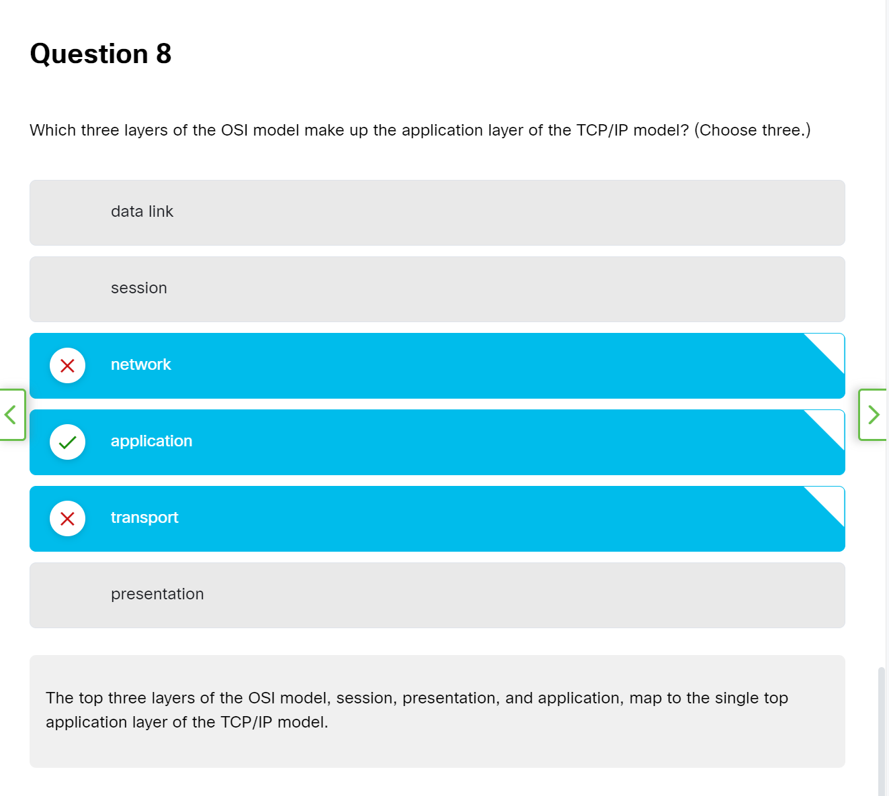  

---

## Module 6 — 100%

No incorrect answers recorded.

---

## Module 7 - 45% (Retake 100%)
 

---

## Checkpoint Exam: Network Access - 71%
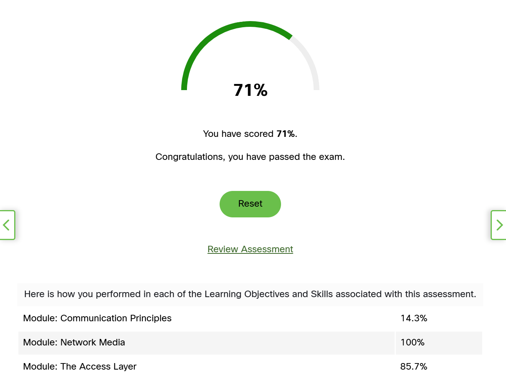 

---

## Module 8 - 73%

---

## Module 9 - 73%
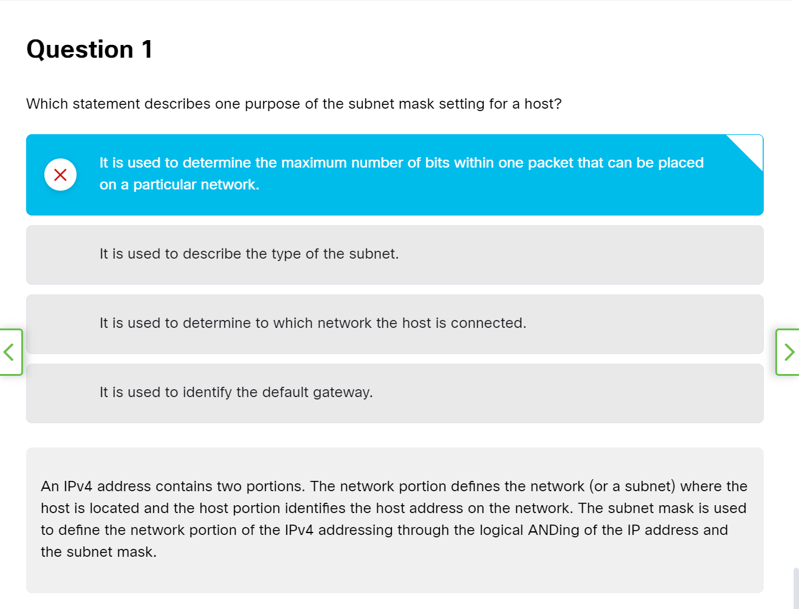

---

## Module 10 - 91%

---

## Module 11 - 82%
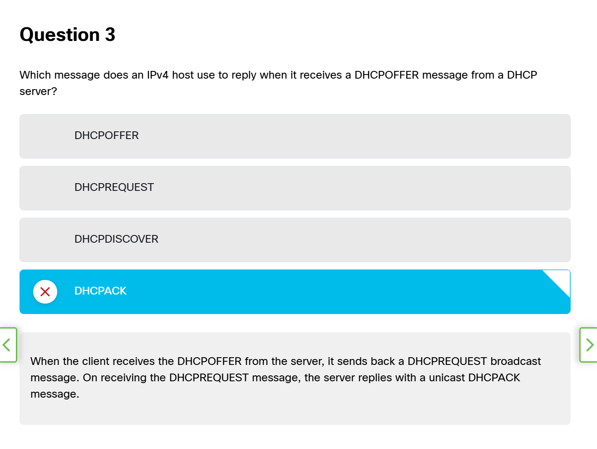
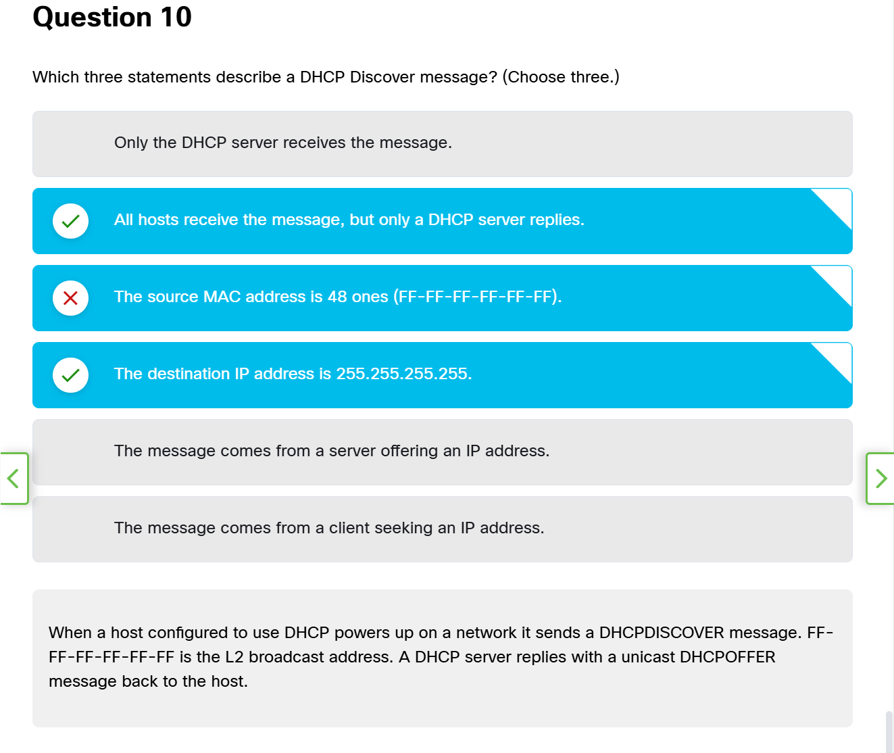

---

## Checkpoint Exam: The Internet Protocol  - 90%
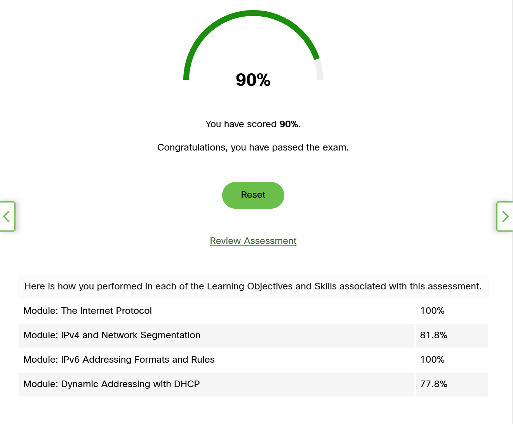

---

## Module 12 - 91%

--- 

## Module 13 - 83%
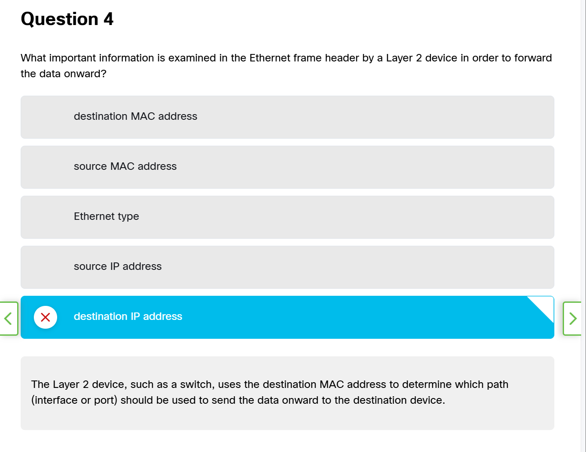
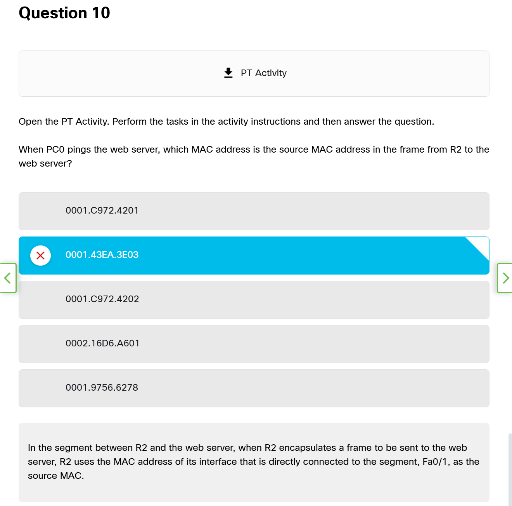

---

## Module 14 - 75%

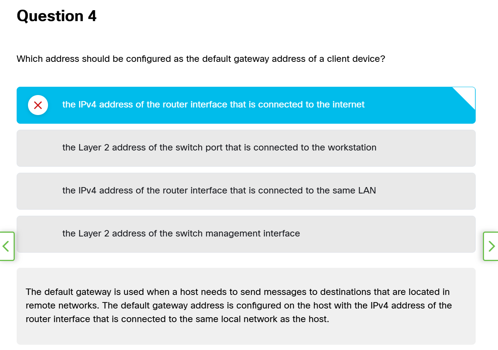
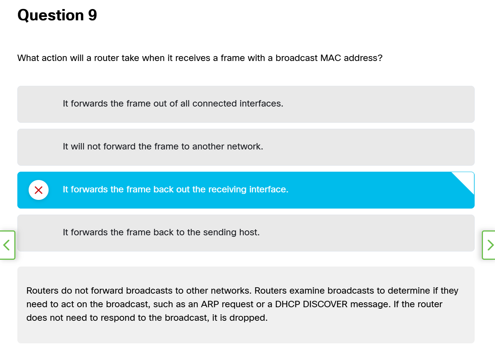

---

## Checkpoint Exam: Communication Between Networks - 95%
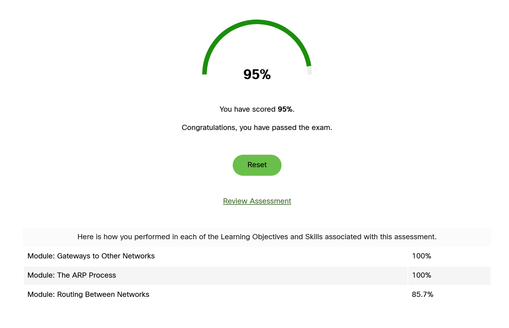

---

## Module 15 - 82%

---
## Module 16 - 91%

## Module 15 -
## Module 16 -
## Module 17 -