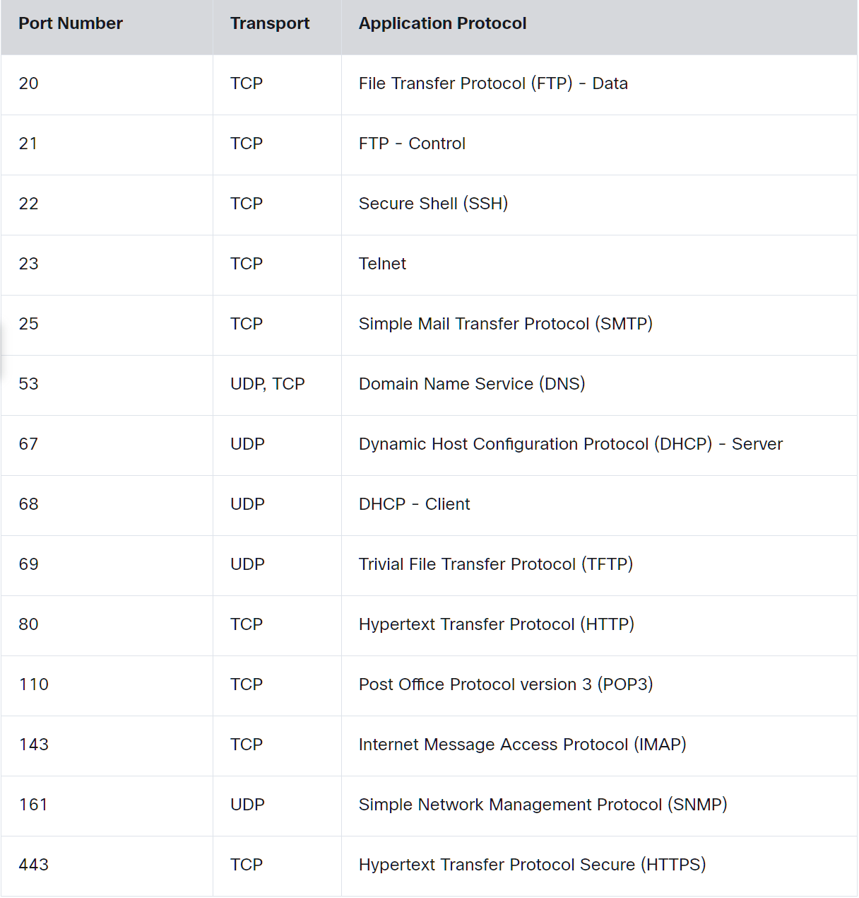

# Terms per Module

This document contains brief definitions of key terms from the  
**Cisco Networking Academy – Networking Basics** course.

---

## Module 1 — Communication in a Connected World
- **Network** – Devices connected to share data.
- **Protocol** – Rules that define how devices communicate.
- **Bandwidth** – Maximum data capacity of a network connection.
- **Latency** – Delay before data begins to transfer.
- **Throughput** – Actual amount of data successfully transferred.
- **Packet** – Small unit of data sent across a network.

---

## Module 2 — Network Components, Types, and Connections
- **ISP (Internet Service Provider)** – Company that provides internet access.
- **Client** – Device that requests services or data.
- **Server** – Device that provides services or data.
- **P2P (Peer-to-Peer) Network** – Devices share resources directly without a central server.
- **Network Infrastructure** – Components that support communication (end devices, intermediate devices, media).
- **DSL (Digital Subscriber Line)** – Internet connection using telephone lines.
- **Satellite Connection** – Internet delivered via satellite.

---

## Module 3 — Wireless and Mobile Networks
- **Wireless Network** – Network that transmits data without cables.
- **Wi-Fi** – Wireless LAN technology based on IEEE 802.11 standards.
- **GPS (Global Positioning System)** – Satellite-based location system.
- **Cellular Data** – Mobile network internet service.
- **Bluetooth** – Short-range wireless communication.
- **NFC (Near Field Communication)** – Very short-range wireless communication.

---

## Module 4 — Build a Home Network
- **WLAN (Wireless Local Area Network)** – Local network using wireless connections.
- **Router** – Device that forwards traffic between networks.
- **SSID (Service Set Identifier)** – Name of a wireless network.
- **IEEE** – Organization that defines networking standards.

---

## Module 5 — Communication Principles
- **IANA (Internet Assigned Numbers Authority)** – Manages global IP address and port allocations.
- **IETF (Internet Engineering Task Force)** – Develops internet standards.
- **TCP/IP Model** – Four-layer model used in real-world networking.
- **OSI Model** – Seven-layer model used to understand networking concepts.

---

## Module 6 — Network Media
- **Twisted-Pair Cable** – Common copper Ethernet cable.
- **Coaxial Cable** – Shielded cable used for broadband and legacy systems.
- **Fiber-Optic Cable** – Cable that transmits data using light.
- **Network Media** – Physical or wireless methods used to carry data.

---

## Module 7 — The Access Layer
- **NIC (Network Interface Card)** – Hardware that connects a device to a network.
- **MAC Address** – Unique Layer 2 hardware address assigned to a NIC.
- **Encapsulation** – Wrapping data with headers as it moves through layers.
- **Ethernet Frame** – Layer 2 data unit used on a LAN.
- **Preamble** – Bits used to synchronize communication.
- **Start Frame Delimiter (SFD)** – Marks the beginning of an Ethernet frame.
- **Frame Check Sequence (FCS)** – Error-detection field in an Ethernet frame.
- **Access Layer** – Network layer where end devices connect to switches.

---

## Module 8 — The Internet Protocol
- **IPv4** – 32-bit logical address used to identify a host.
- **Subnet Mask** – Identifies the network and host portions of an IP address.
- **Network Address** – First address in a subnet; identifies the network.
- **Broadcast Address** – Last address in a subnet; reaches all devices.
- **Host Address** – Usable IP address assigned to a device.
- **Default Gateway** – Router address used to access other networks.
- **Public IPv4 Address** – Globally routable IP address.
- **Private IPv4 Address** – Internal IP address not routable on the internet.
  - **10.0.0.0 – 10.255.255.255** – Common in enterprise networks
  - **172.16.0.0 – 172.31.255.255** – Often used in business environments
  - **192.168.0.0 – 192.168.255.255** – Common in home networks
- **Binary** – Base-2 numbering system (0 and 1).
- **Octet** – One 8-bit section of an IPv4 address.

---

## Module 9 — IPv4 and Network Segmentation
- **Unicast** – One-to-one communication.
- **Broadcast** – One-to-all communication.
- **Multicast** – One-to-many group communication.
- **Loopback Address** – 127.0.0.1; used to test the local device.
- **Link-Local Address** – 169.254.x.x; assigned when DHCP fails.
- **APIPA (Automatic Private IP Addressing)** – Windows feature that assigns link-local addresses.
- **RIR (Regional Internet Registry)** – Allocates IP address ranges by region.
- **ARP (Address Resolution Protocol)** – Maps IP addresses to MAC addresses.
- **DHCP (Dynamic Host Configuration Protocol)** – Automatically assigns IP settings.
- **Subnetting** – Dividing a network into smaller logical networks.
- **Experimental Address Range** – 240.0.0.0 – 255.255.255.254; reserved for future use.

---

## Module 10 — IPv6 Addressing
- **Dual Stack** – Running IPv4 and IPv6 together.
- **Tunneling** – Sending IPv6 traffic inside IPv4 packets.
- **Translation** – Converting between IPv4 and IPv6.
- **Hexadecimal** – Base-16 numbering system (0–9, A–F).
- **IPv6 Address Format** – 128-bit address written in eight groups separated by colons.

---

## Module 11 — Dynamic Addressing with DHCP
- **Static Address** – Manually assigned IP address.
- **Dynamic Address** – Automatically assigned IP address.
- **DHCP Discover** – Client searches for DHCP server.
- **DHCP Offer** – Server offers IP configuration.
- **DHCP Request** – Client requests offered address.
- **DHCP Acknowledgement (ACK)** – Server confirms assignment.

---

## Module 12 — Gateways to Other Networks
- **Network Boundary** – Point where two networks connect.
- **NAT (Network Address Translation)** – Converts private IPs to public IPs.

---

## Module 13 — The ARP Process
- **Physical Address (MAC Address)** – Used within the same local network.
- **Logical Address (IP Address)** – Used across networks.
- **Layer 2 Frame** – Data unit at the Data Link layer.
- **Layer 3 Packet** – Data unit at the Network layer.
- **ICMPv6 Neighbor Discovery (ND)** – IPv6 method for resolving MAC addresses.
- **Ethernet Broadcast** – Frame sent to all devices in a broadcast domain.

---

## Module 14 — Routing Between Networks
- **Routing** – Forwarding packets between networks.
- **Routing Table** – List of paths used to forward traffic.
- **LAN (Local Area Network)** – Network within a limited area.

---

## Module 15 — TCP and UDP

- **Transport Layer Protocols** – Protocols responsible for end-to-end communication between hosts.

- **TCP (Transmission Control Protocol)** – Reliable, connection-oriented protocol that ensures data is delivered in order using acknowledgements and sequence numbers.

- **UDP (User Datagram Protocol)** – Fast, connectionless protocol used for streaming and real-time communication. No acknowledgements and no guaranteed delivery.

- **Port Number** – Identifies a specific application or service on a device.
  - **Well-known ports (0–1023)** – Reserved for common services (e.g., HTTP 80, HTTPS 443).
  - **Registered ports (1024–49151)** – Assigned to user processes or applications.
  - **Private/Dynamic ports (49152–65535)** – Used temporarily by client applications.

- **Three-Way Handshake** – TCP connection setup process:
  - SYN  
  - SYN-ACK  
  - ACK  

- **Flow Control** – Regulates the rate of data transmission to prevent overwhelming the receiver.

- **Socket Pair** – Combination of source IP + source port and destination IP + destination port that uniquely identifies a connection.

- **Segment** – The data unit used at the Transport layer (TCP/UDP).

- **netstat** – Command-line tool used to display active network connections and listening ports.

---

## Module 16 — Application Layer Services

### Client-Server Relationship
A client (e.g., web browser) sends a request to a server.  
Example process:
1. DNS lookup converts the URL into an IP address.
2. A TCP connection is established (socket created).
3. The server receives the request on the correct port (e.g., 80 for HTTP).
4. The server processes the request and sends a response.

- **Uniform Resource Identifier (URI)** - A general identifier for a resource on the internet.
- **URL (Uniform Resource Locator)** – Specifies the location of a resource.
- **URN (Uniform Resource Name)** – Identifies a resource by name without specifying its location.

**Parts of a URI**
Example: https://example.com/docs/index.html#section1

- **Scheme/Protocol** – `https`
- **Hostname** – `www.example.com`
- **Path** – `/docs/index.html`
- **Fragment** – `#section1`

---

### Common Application Layer Protocols

- **DNS (Domain Name System)** – Resolves domain names to IP addresses.
- **nslookup** – Tool used to query DNS servers.
- **HTTP (Hypertext Transfer Protocol)** – Transfers web pages.
- **HTML (Hypertext Markup Language)** – Structure of web pages.
- **FTP (File Transfer Protocol)** – Transfers files between systems.
- **Telnet** – Remote login protocol (unencrypted).
- **SSH (Secure Shell)** – Secure remote login protocol.
- **SMTP (Simple Mail Transfer Protocol)** – Sends email.
- **POP3 (Post Office Protocol v3)** – Retrieves email from a server.
- **IMAP4 (Internet Message Access Protocol v4)** – Accesses email while keeping it on the server.
- **VoIP (Voice over Internet Protocol)** – Voice communication over IP networks.

## OSI Model (7 Layers)
1. Application  
2. Presentation  
3. Session  
4. Transport  
5. Network  
6. Data Link  
7. Physical  

---

## TCP/IP Model (4 Layers)
1. Application  
2. Transport  
3. Internet  
4. Network Access  

---

## OSI vs TCP/IP Mapping
- OSI 7–5 → TCP/IP 1 - Application  
- OSI 4 → TCP/IP 4 - Transport  
- OSI 3 → TCP/IP Internet  
- OSI 2–1 → TCP/IP 4 - Network Access  

---

---

## Resources
- [Network Access Layer: Introduction — Rick Graziani](https://www.youtube.com/watch?v=k1AC96Ppuzc&list=PLMLm7-g0V0ke_dSguEQfz-ZSHrSUikTJ7)
