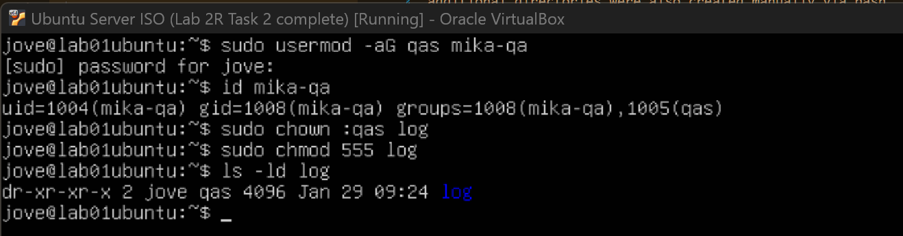

# Lab 2R — Linux User & Group Management (Independent Practice)

## Lab Metadata
- **Category:** System Administration
- **Subdomain:** Linux Administration
- **Difficulty:** Beginner
- **Mode:** Scenario was AI generated
- **Status:** In Progress
- **Estimated Time:** (pending)

---

## Scenario Overview

You are acting as a **Junior Linux System Administrator** in a small organization.  
A new internal application project is starting, and you are responsible for:

- Onboarding users
- Managing group-based access
- Enforcing least privilege
- Troubleshooting permission issues
- Offboarding users cleanly

All access must be controlled through **groups and permissions**, not per-user exceptions.

---

## Environment
- **Host OS:** Windows 11
- **Hypervisor:** VirtualBox
- **Guest OS:** Ubuntu Server 22.04 LTS
- **Lab VM:** Keep Lab 2 users/groups and create new ones for this scenario

---

## Roles & Access Model

| Role | Purpose | Access Summary |
|-----|--------|----------------|
| sysadmin | Full system administration | Full sudo |
| devs | Application deployment | Write to app directory, limited sudo |
| qa | Testing and verification | Read-only access to logs |
| interns | Training only | Restricted training directory |

---


## Task 3 — Configure Shared Directories & Permissions (pending)


### User Story
As a team, we need shared directories where access is granted only to the appropriate roles.


### Acceptance Criteria
- [ ] Dev users can write to the application directory
- [ ] QA users can read logs but cannot modify them
- [ ] Interns can only access the training directory
- [ ] Unauthorized access attempts fail


### Directories
- **Application directory:**  
- **Log directory:**  
- **Training directory:** 


### Tasks Performed
Three directories were created using a single `mkdir` command (`mkdir dir1 dir2 dir3`). This approach is more efficient than creating each directory individually and helps reduce repetitive steps. For demonstration purposes, additional directories were also created manually via bash.


Users had previously been created with their own home directories. In this task, users were added to their respective shared groups to enable group-based access. For example, `alex-dev` was added to the `devs` group, and group membership was verified to confirm the update.


Directory ownership and permissions were then updated to allow the appropriate group write access. The application directory was assigned to the `devs` group, with permissions configured to allow group collaboration while restricting access for non-members.


When I tested whether `alex-dev` (in the `devs` group) could access the `application` folder, I initially got **“No such file or directory”**. This turned out to be a **path issue** — I was trying to access `/application`, but the folder I created was actually inside my home directory (e.g. `/home/jove/application`).


I tried again using the correct location but I got **“Permission denied”**. I was sure that the application folder was for the devs group in which alex-dev is a member of. 


To address the permission issue, I reviewed the permissions on both the application directory and its parent directory. It took some time to fully understand the permission string format, but this exercise helped clarify how Linux evaluates access step by step.


I learned that Linux checks permissions on **every directory in the path**, starting from the root and moving down to the target directory. If access is denied at any level, the check stops immediately.

---

### `drwxr-x---` Parent Directory (`/home/jove`)

- **d** → directory

**Owner permissions**
- `r` → can list contents  
- `w` → can create, delete, or rename files  
- `x` → can enter the directory  

**Group permissions**
- `r` → group can list contents  
- `x` → group can enter the directory  
- `-` → no write access  

**Other permissions**
- `-` → no read  
- `-` → no write  
- `-` → no execute (cannot enter directory) !!!

Because `alex-dev` is neither the owner (`jove`) nor a member of the `jove` group, Linux evaluated the **others** permissions and denied access at this level.

---

### `drwxrwsr-x` Application Directory

- **d** → directory

**Owner permissions**
- `r` → can list contents  
- `w` → can create, delete, or rename files  
- `x` → can enter the directory  

**Group permissions**
- `r` → group can list contents  
- `w` → group can create and delete files  
- `s` → setgid (new files inherit the directory’s group)

**Other permissions**
- `r` → can list contents  
- `x` → can enter the directory  
- `-` → no write access  

Even though the application directory was correctly configured for the `devs` group, access was blocked earlier due to the restrictive permissions on the parent directory. This issue proves that Linux enforces permissions on every directory in the path, not just the target directory. To fix this issue, 


### Commands Used
```bash
mkdir <directoryname>
mkdir <dir1> <dir2> <dir3>
usermod -aG <groupname> <username>
id <username>
ls -l
chown :<groupname> <directoryname>
chmod 2775 <directoryname>
``` 


### Reflection
This task reinforced how group-based permissions simplify access management across shared directories. Using group ownership and setgid reduced the need for individual user permissions and made the setup easier to maintain. I’m getting more comfortable with the workflow, but I still get mixed up with the numeric values for setgid and permissions, so I’ll need more hands-on practice.




---


## Task 4 — Implement Least-Privilege Sudo Access (pending)

### User Story
As an administrator, I want developers to run limited administrative commands without granting full sudo access.

### Scope of Elevated Access
- **Allowed:**  
- **Not allowed:**  

### Tasks Performed
- 
- 
- 

### Acceptance Criteria
- [ ] `sudo -l` shows only approved commands
- [ ] Privilege escalation beyond scope is denied
- [ ] System integrity remains intact

### Evidence
- Screenshot(s):
- Command output(s):

---

## Task 5 — Incident Response: Permission Denied (pending)

### Incident Description
A developer reports receiving **“Permission denied”** while working in the application directory.

### Investigation
- **Observations:**  
- **Root cause identified:**  

### Resolution
- 
- 
- 

### Acceptance Criteria
- [ ] Root cause clearly identified
- [ ] Issue resolved without weakening security
- [ ] Least privilege preserved
- [ ] Access restored only where appropriate

### Evidence
- **Before:**  
- **After:**  

---

## Task 6 — User Offboarding & Audit (pending)

### User Story
As an administrator, I want to remove access cleanly when a staff member leaves.

### Offboarded User
- **Username:**  
- **Role:**  

### Tasks Performed
- 
- 
- 

### Acceptance Criteria
- [ ] User can no longer log in
- [ ] Group memberships updated
- [ ] No orphaned permissions remain
- [ ] Audit snapshot captured

### Evidence
- Screenshot(s):
- Command output(s):

---


## Next Steps

- 
- 
- 

---

### Notes
This lab was completed **without AI assistance**, using:
- Personal notes
- System documentation (`man`)
- Trial-and-error testing
- Research and Video tutorials


## Tasks
- [Task 1 — Group / Role Management](./task-01.md)
- [Task 2 — User Management](./task-02.md)
- [Task 3 — Shared Directories & Permissions](./task-03.md)
- [Task 4 — Least-Privilege Sudo Access](./task-04.md)
- [Task 5 — Incident Response: Permission Denied](./task-05.md)
