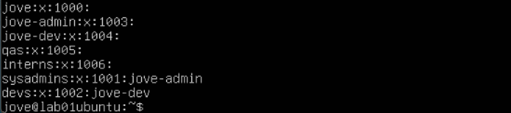

## Task 1 — Group / Role Management

### User Story
As an administrator, I want role-based groups so permissions can be managed consistently and securely.


### Acceptance Criteria
- [x] Groups exist and are visible in the system  
- [x] Group IDs and memberships can be verified  
- [x] No users have unnecessary privileges  


### Tasks Performed
Existing role-based groups (`admins` and `developers`) were already present from the initial Lab 2 setup, so these were reused and refined rather than recreated.

I used `getent group` to review all groups present on the system. This returned a large list, which initially caused some confusion. This behaviour is expected, as Linux includes many pre-existing system groups in addition to administrator-defined groups.

During this review, I observed that custom user and role-based groups typically start at GID 1000 and above, while system groups generally use lower GID values. While I have not yet explored the full reasoning behind this design choice, it has been noted for further research.

To align with clearer role naming and least-privilege principles, the following changes were made:
- Renamed `admins` to `sysadmins`
- Renamed `developers` to `devs`
- Created new role-based groups: `qas` and `interns`

New groups were created using the `groupadd` command, and existing groups were renamed using the `groupmod` command.


### Commands Used
```bash
getent group
groupadd <groupname>
groupmod -n <new-group-name> <old-group-name>
```

### Evidence
- [Check existing group](./screenshots/01-getent-group.png)
- [Add a group](./screenshots/02-group-add.png)
- [Modify Group](./screenshots/03-group-mod.png)
- [Verify updates](./screenshots/05-verify-group-update.png)





### Reflection
In this task I learned how effective group naming and structure support role-based access control (RBAC). Renaming and reusing groups mirrored real-world administration, where changes are often made on existing systems rather than starting from scratch. Task 1 was straightforward and commands were easy to follow.

---