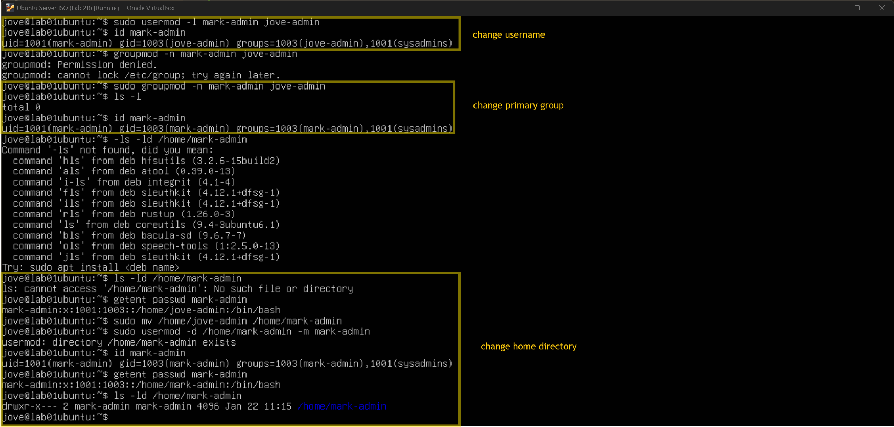

## Task 2 — User Management


### User Story
As an administrator, I want new staff accounts created with correct group membership and secure defaults.


### Acceptance Criteria
- [x] Users exist and can log in
- [x] Correct primary and secondary groups assigned
- [x] Home directories exist with correct ownership
- [x] No administrative access granted unintentionally


### Tasks Performed
To reduce naming confusion and better reflect role intent, I first renamed the existing administrative user `jove-admin` to `mark-admin`. During this process, I learned that Linux does **not** automatically update a user’s primary group name or home directory when a username is modified. These components must be handled separately to maintain consistency. In the screenshot I did 3-steps to complete the setup. 



After confirming the administrative account was correctly updated, I created additional role-based users for the environment. Each user was created with a home directory and default shell, then verified to ensure correct UID, GID, group membership, and home directory ownership.

- **Developers** alex-dev
- **QA** mika-qa
- **Interns** sam-intern

  
  
 


Note: Attempts to elevate privileges using `sudo` and switch users using `su` were intentionally denied. This confirms that only explicitly authorised accounts can perform administrative actions, enforcing least-privilege access.


### Commands Used
```bash
usermod -l <new-username> <old-username>
groupmod -n <new-groupname> <old-groupname>
ls -ld /home/<username>
useradd -m -s /bin/bash <username>
getent passwd <username>
id <username>
sudo -l -U <username>
```

### Reflection
This task showed that updating user accounts in Linux often involves multiple steps to keep usernames, groups, and home directories consistent. Creating and validating role-based users reinforced the importance of checking permissions instead of relying on defaults. I’ll need more practice with Task 2 to fully lock in the workflow.

---