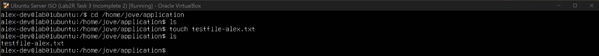
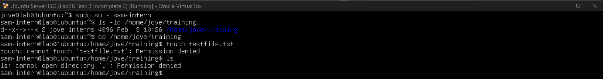

## Task 3 - Configure Shared Directories & Permissions

### User Story
As a team, we need shared directories where access is granted only to the appropriate roles.

---

### Acceptance Criteria
- [x] Dev users can write to the application directory
- [x] QA users can read logs but cannot modify them
- [x] Interns can only access the training directory
- [x] Unauthorized access attempts fail

---

### Directories
- **Application directory:** `/home/jove/application`
- **Log directory:** `/home/jove/logs`
- **Training directory:** `/home/jove/training`

---

## Tasks Performed

### Create Directories
Three directories were created using a single `mkdir` command (`mkdir dir1 dir2 dir3`). This approach is more efficient than creating each directory individually and reduces repetitive steps. For demonstration purposes, additional directories were also created manually via the CLI.


---

### Assign Users to Groups
Users had already been created with individual home directories. In this step, users were added to their respective role-based groups to enable shared access. For example, `alex-dev` was added to the `devs` group, and group membership was verified to confirm the update.


---

### Configure Directory Ownership & Permissions
Directory ownership and permissions were updated to allow the appropriate group-level access. The application directory was assigned to the `devs` group, with permissions configured to allow group collaboration while restricting access for non-members.


---

## Troubleshooting & Validation

### “No such file or directory”
When testing access as `alex-dev`, the initial attempt returned **“No such file or directory”**. This was due to an incorrect path being used (`/application` instead of `/home/jove/application`).


---

### “Permission denied”
After correcting the path, access was still denied. This was unexpected, as the application directory permissions appeared to be correctly configured for the `devs` group.


---

### Checking Permissions
To troubleshoot, I reviewed the permissions on both the application directory and its parent directory. This helped clarify how Linux evaluates permissions **at every level of the directory path**.


Linux checks permissions starting from the root directory and continues down the path. If access is denied at any level, the process stops immediately.

---

### Permission Breakdown — Parent Directory (`/home/jove`)
**Permissions:** `drwxr-x---`

- **Owner (`jove`)**: full access
- **Group**: read and execute
- **Others**: no access

Because `alex-dev` is neither the owner nor part of the `jove` group, Linux evaluated the **others** permissions and denied access at this level.

---

### Permission Breakdown — Application Directory (`/home/jove/application`)
**Permissions:** `drwxrwsr-x`

- Group permissions were correctly configured
- `setgid` ensured new files inherit the `devs` group

Even though this directory was configured correctly, access was blocked earlier by the parent directory.

---

### Fix: Allow Directory Traversal
To resolve this, execute permission was added for **others** on the parent directory, allowing users to traverse the path without viewing or modifying its contents.

```bash
sudo chmod o+x /home/jove

```

This resolved the access issue without moving the directory. Authorized users can now traverse the path to the shared application folder, while the contents of the home directory remain protected. 


-[Read-only Access for QA](./screenshots/14-read-only-access-qas.png)
-[Access only Interns](./screenshots/15-access-only-interns.png)


---

### Acceptance Criteria Validation

**1. Dev users can write to the application directory**

alex-dev successfully accessed the application directory and created a file.




**2. QA users can read logs but cannot modify them**
alex-dev successfully accessed the application directory and created a file.


**3. Interns can only access the training directory**

A test log file was created by an admin user. QA users could read the file but were blocked from editing or creating files.




**4. Unauthorized access attempts fail**
Intern users could enter the training directory but were blocked from listing contents or creating files.

---

### Commands Used
```bash
mkdir <directoryname>
mkdir <dir1> <dir2> <dir3>
usermod -aG <groupname> <username>
id <username>
ls -l
chown :<groupname> <directoryname>
chmod 2775 <directoryname>
sudo chmod o+x <path>
``` 

---

### Reflection
This task took some time to fully understand, especially when navigating directories and interpreting permission strings, which felt confusing at first. Working through the permission errors helped clarify how Linux evaluates access step by step, rather than just at the target directory.

I also learned that permissions can be expressed numerically, which I haven’t fully memorised yet. I plan to repeat this exercise using numeric permission values to become more comfortable with them. Overall, this task helped solidify how Linux handles user, group, and directory permissions through a clear hierarchy.

---

### References/Learning Aid
- [Linux Crash Course - Understanding File & Directory Permissions](https://www.youtube.com/watch?v=4e669hSjaX8&list=PLT98CRl2KxKHKd_tH3ssq0HPrThx2hESW&index=77)
