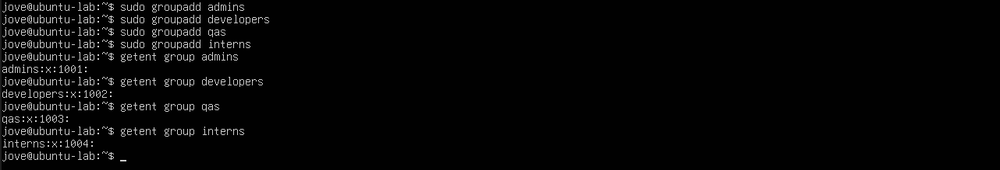
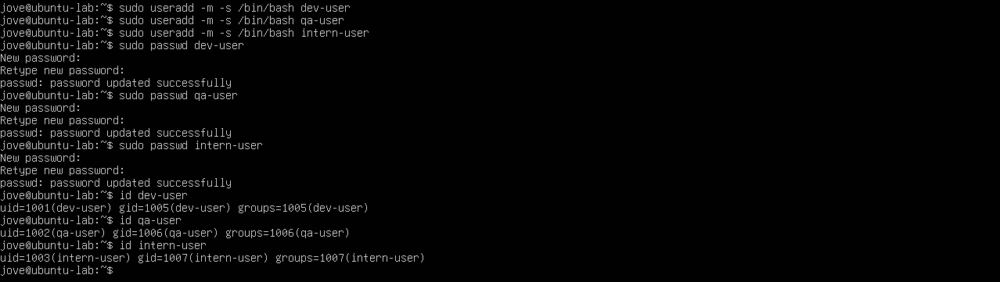
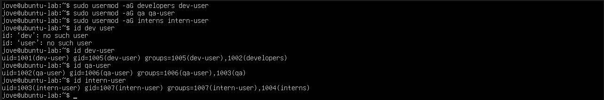
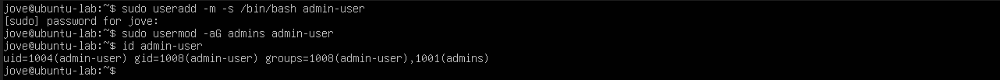
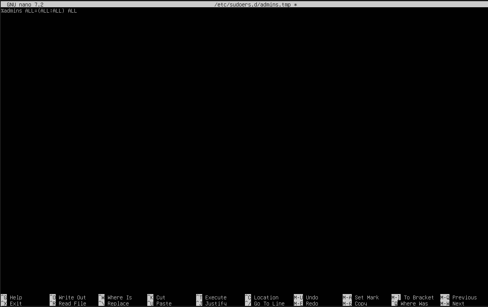
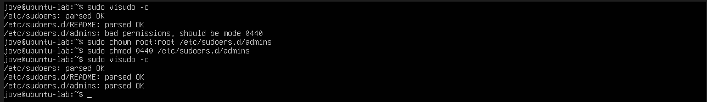

# Lab 2 — User and Group Management

## Lab Metadata
- **Category:** System Administration
- **Subdomain:** Linux Administration
- **Difficulty:** Beginner
- **Status:** Completed 2026-02-21

---

## Objective
This lab focuses on managing Linux users and groups, implementing role-based access control, and enforcing least-privilege administration using `sudo`.

The goal is to demonstrate how administrative access is controlled through group membership and how misconfigurations can be identified and corrected.

---

## Environment
- **Host OS:** Windows 11
- **Hypervisor:** VirtualBox
- **Guest OS:** Ubuntu Server 22.04 LTS
- **Lab VM:** Same environment as Lab 01

---

## Tasks Performed

### Task 1 — Create Groups

Groups were created to represent different organizational roles within the system.

- admins
- developers
- qa
- interns

The `groupadd` command was used to create each group, and `getent group` was used to verify successful creation.

```bash
sudo groupadd admins
sudo groupadd developers
sudo groupadd qa
sudo groupadd interns

getent group admins
getent group developers
getent group qa
getent group interns
```

**Evidence:**


---

### Task 2 — Create Users

Users were created to simulate role-based accounts within the system.

- dev-user
- intern-user
- qa-user

The `useradd` command was used with the `-m` option to create a home directory and the `-s` option to assign the default login shell (`/bin/bash`). Passwords were then configured using the `passwd` command.

User creation was verified using the `id` command to confirm account existence and group information.

```bash
sudo useradd -m -s /bin/bash dev-user
sudo useradd -m -s /bin/bash qa-user
sudo useradd -m -s /bin/bash intern-user

sudo passwd dev-user
sudo passwd qa-user
sudo passwd intern-user

id dev-user
id qa-user
id intern-user
```
**Evidence:**


---

### Task 3 — Assign Users to Groups

Users were assigned to their respective role-based groups using the `usermod` command.

The `-aG` option appends the user to a supplementary group without removing existing group memberships.

Group membership was verified using the `id` command.

```bash
sudo usermod -aG developers dev-user
sudo usermod -aG qa qa-user
sudo usermod -aG interns intern-user

id dev-user
id qa-user
id intern-user
```

**Evidence:**


---

### Task 4 — Configure & Validate Sudo Access

Sudo access was granted **only** to the `admins` group using a dedicated sudoers file in `/etc/sudoers.d/`.  
An admin account (`admin-user`) was created and added to the `admins` group to simulate role-based administrative access.

A configuration check was performed using `visudo -c` to validate sudoers syntax and prevent lockout. During validation, a warning appeared because the sudoers file permissions were not set to **0440**. This was fixed by setting the file owner to `root:root` and permissions to `0440`.

```bash
# Create admin user and set password
sudo useradd -m -s /bin/bash admin-user
sudo passwd admin-user

# Create admins group (if not already created) and add user to it
sudo groupadd admins
sudo usermod -aG admins admin-user

# Create sudoers rule for admins group
sudo visudo -f /etc/sudoers.d/admins
# Add this line inside the file:
# %admins ALL=(ALL:ALL) ALL

# Validate sudoers configuration
sudo visudo -c

# Fix sudoers file ownership and permissions (required: 0440)
sudo chown root:root /etc/sudoers.d/admins
sudo chmod 0440 /etc/sudoers.d/admins

# Re-validate after the fix
sudo visudo -c
```

**Evidence:**





---

### Task 5 - Shared Directory with Group-Based Access (setgid)
A shared directory was created to allow collaborative access for the developers group while preventing access by non-members.

```bash
sudo mkdir -p /srv/devshare
sudo chown root:developers /srv/devshare
sudo chmod 2770 /srv/devshare
```
The setgid bit ensures all new files inherit the developers group.
Access was validated by testing write permissions as a group member and as a non-member.

**Evidence:**
- [07-sudo-access-jove-admin](./screenshots/07-sudo-access-jove-admin.png)
- [08-sudo-access-jove-dev-denied](./screenshots/08-sudo-access-jove-dev-denied.png)
- [09-devshare-permissions](./screenshots/09-devshare-permissions.png)
- [10-dev-write-success](./screenshots/10-dev-write-sucess.png)
- [11-non-member-denied](./screenshots/11-non-member-denied.png)

---

## Security Considerations
- Administrative privileges are granted strictly through group membership.
- Direct root login is avoided in favor of sudo.
- Sudoers configuration is isolated in /etc/sudoers.d/ and validated with visudo.
- Group-based permissions and setgid are used to control shared access without elevating privileges.

---

## Reflection
This lab showed me how Linux access control is primarily driven by group membership and permissions rather than individual users. Working through permission issues highlighted how easily misconfigurations can occur and the importance of validating access using tools such as `id`, `sudo -l`, and `ls -ld`.

Running the lab locally in VirtualBox made it easier to experiment and troubleshoot. I plan to revisit this lab with minimal guidance to further strengthen my understanding.

---

## Next Steps
- Practice file ownership and permission management in more depth before proceeding to Lab 3
- Continue building Linux administration labs to strengthen troubleshooting skills

---

## Scenario-Based Practice
To apply these concepts in a realistic environment involving role changes, permission issues, and least-privilege enforcement, see:

- [Scenario 1 — Role & Permission Incident Response](./scenario-01/README-scenario01.md)

