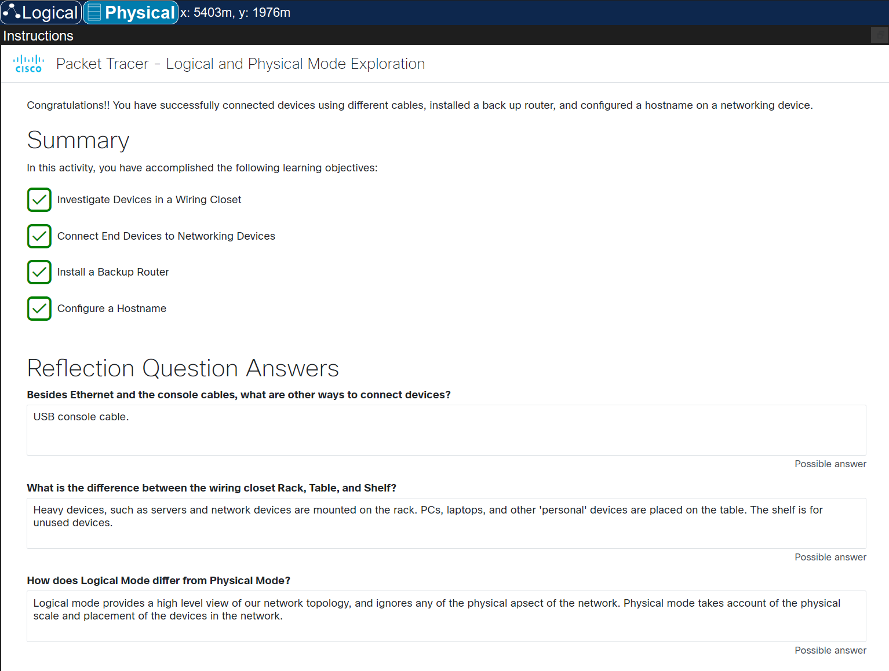

# Cisco Packet Tracer - Lab 00 - Logical & Physical Mode Exploration

## Objective

The goal of this lab was to become familiar with the Cisco Packet Tracer interface and understand:

- Logical vs Physical workspace
- Device placement and wiring
- Console connections
- Basic router CLI interaction
- Activity workflow using hints

This was my first time using Packet Tracer, so the focus was tool familiarity rather than deep configuration.

---

## Tasks Performed

### 1️⃣ Navigated Logical & Physical Modes
- Switched between Logical and Physical views
- Explored device locations inside racks and wiring closets
- Practiced zooming and panning across larger workspaces
- Identified how devices are organized in physical environments

---

### 2️⃣ Connected Devices via Console
- Connected Laptop RS232 → Router Console using console cable
- Accessed router CLI through:
  - `Desktop → Terminal`
- Observed router boot process
- Interacted with CLI prompts (`Router>`, `Router#`)

---

## Reflection

This lab helped me become comfortable with the Packet Tracer interface.

Initially, navigating between Logical and Physical views was confusing, and the cable icons were not clearly labeled. I relied on hints and experimentation to understand how devices are connected and configured.

I also encountered a router boot issue that required restarting Packet Tracer, which reinforced the importance of troubleshooting simulated environments.

Overall, this lab strengthened my confidence in:
- Navigating Packet Tracer
- Understanding device placement
- Accessing router CLI through console connections
- Interpreting boot messages and prompts

Although this was a foundational lab, it established the groundwork for more advanced networking configurations.

---

## Evidence

