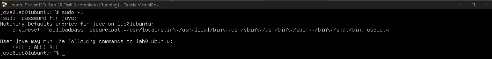
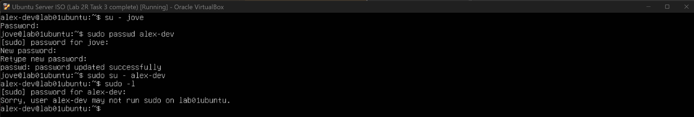
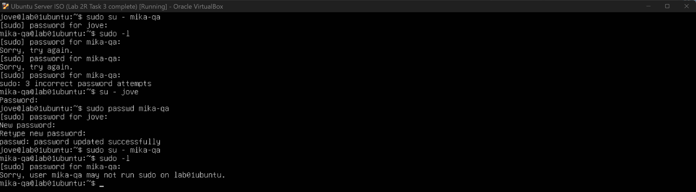
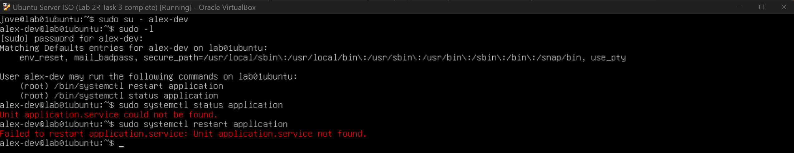
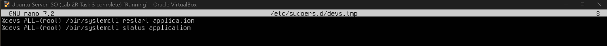
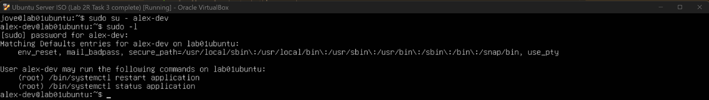

## Task 4 — Implement Least-Privilege Sudo Access (Pending)

### User Story
As an administrator, I want developers to run limited administrative commands without granting full sudo access.

---

### Acceptance Criteria
- [ ] `sudo -l` shows only approved commands
- [ ] Privilege escalation beyond scope is denied
- [ ] System integrity remains intact

---

### Scope of Elevated Access

**Allowed**
- Developers can check the status of the application service
- Developers can restart the application service

**Not Allowed**
- Full administrative (sudo) access
- User, group, or system configuration changes

---

### User Roles & Sudo Policy
The following users and sudo access rules were defined:

- **jove** (Primary Admin)  
  Full sudo access

- **alex-dev** (Developer)  
  Limited sudo access for specific application-related commands only

- **mika-qa** (QA)  
  No sudo access

- **sam-intern** (Intern)  
  No sudo access

---

### Tasks Performed

#### Defining the Policy
A least-privilege sudo policy was designed so that developers can perform basic operational tasks (such as restarting or checking the status of the application service) without being able to fully administer the system.

---

#### Verifying Sudo Access

**jove (Primary Admin)**  
Full sudo access was verified successfully.



---

**alex-dev (Developer)**  
When initially testing sudo access as `alex-dev`, I was prompted for a password. I first attempted to use the primary admin (`jove`) password, assuming it applied to all users. This failed, which helped clarify that sudo authentication requires the **current user’s own password**, not another user’s credentials.

After setting a password for `alex-dev`, sudo access was tested again and behaved as expected.



---

**mika-qa (QA)**  
Based on the behaviour observed with `alex-dev`, a password was set for `mika-qa` before verifying sudo access. The account was correctly denied any sudo privileges.



---

**sam-intern (Intern)**  
A password was set for `sam-intern` prior to verification. As expected, the account was unable to execute any sudo commands, confirming least-privilege enforcement.


---

Based on the current access requirements, only the `alex-dev` account needed limited sudo privileges.

---

### Defined Developer Sudo Scope
Developers are allowed to:
- Restart the application service
- Check the application service status

All other administrative actions are intentionally restricted.

---

### Implementing Limited Sudo Access
From the primary admin account (`jove`), I accessed `visudo` and added specific sudo rules for `alex-dev`. These rules explicitly allow only the required application-related commands.


After applying the configuration, I switched to `alex-dev` and verified the assigned permissions. Running `sudo -l` correctly displayed the limited set of allowed commands. The commands themselves failed to execute because the application service does not yet exist, which is expected behaviour at this stage.



To confirm that access was properly restricted, I attempted to run additional sudo commands that were not explicitly permitted. All attempts failed, confirming that least-privilege rules were being enforced.


---

### Transition to Group-Based Sudo Access
At this point, I realised that assigning sudo permissions to an individual user does not scale well. Instead, sudo access should be applied at the group level so that any user in the `devs` group automatically inherits the same permissions.

The sudo rule was updated to reference the `devs` group using `%devs` instead of the individual user account.


As a cleaner and more maintainable approach, I also tested creating a dedicated sudoers file for the `devs` group under `/etc/sudoers.d/`.



After removing the user-specific rule and applying the group-based configuration, sudo access was tested again as `alex-dev` (a member of the `devs` group). The results were identical, confirming that the group-based sudo policy was working as intended.




### Commands Used
```bash
sudo -l
sudo passwd user
sudo visudo
sudo visudo -f /etc/sudoers.d/group
``` 

---

### Reflection
This task helped clarify how least-privilege sudo access should be designed and tested in practice. I learned that sudo authentication is tied to the current user’s password and that permissions must be explicitly defined, otherwise access is denied by default.

Starting with user-specific sudo rules made it easier to test and understand the behaviour, but transitioning to group-based sudo access highlighted a more scalable and maintainable approach. Even though the application service does not yet exist, the failed command execution still confirmed that the sudo rules were applied correctly and restricted to the intended scope.

Overall, this task shows the importance of defining clear access boundaries and validating both allowed and denied actions when implementing sudo policies.

(PENDING) - Create a dummy application service and test again.


### References/Learning Aid
- [Linux Crash Course - sudo](https://www.youtube.com/watch?v=07JOqKOBRnU)
- [How to Add Sudo Users in Linux Using /etc/sudoers.d](https://www.youtube.com/watch?v=c5sQDB979c0)