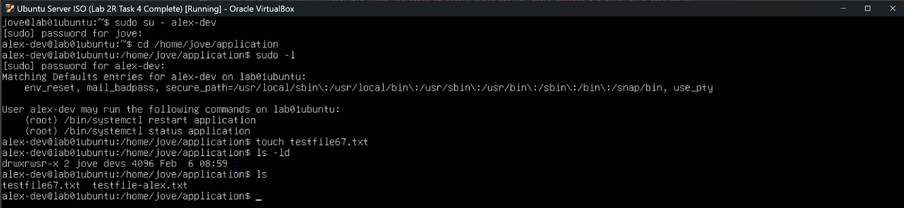

## Task 5 — Incident Response: Permission Denied

### Incident Description
A developer reported receiving a **“Permission denied”** error when attempting to access the application directory, despite being a member of the correct group.

### Investigation
- **Observations:**  
  The developer was a member of the `devs` group, and the application directory had the expected group permissions. However, access was still denied.

- **Root cause identified:**  
  The parent directory (`/home/jove`) did not allow directory traversal for users outside the owner or group. Linux enforces permissions on every directory in the path, which prevented access to the application directory.

### Resolution
- Reviewed permissions on the parent and target directories (resolved in **Task 3**).
- Added execute-only permission to the parent directory to allow directory traversal while preserving least privilege.
- Verified that no additional read or write access was granted.
- Limited sudo access for developers was implemented and verified in **Task 4**.

### Acceptance Criteria
- [x] Root cause clearly identified
- [x] Issue resolved without weakening security
- [x] Least privilege preserved
- [x] Access restored only where appropriate

### Evidence
**Before:** Permission denied when accessing the application directory  

**After:** Developer able to access and write to the application directory

