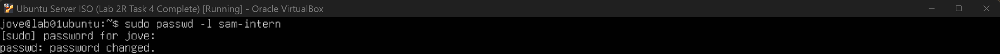

## Task 6 — User Offboarding & Audit

### User Story
As an administrator, I want to remove access cleanly when a staff member leaves.

### Offboarded User
- **Username:** sam-intern  
- **Role:** Intern  

---

### Acceptance Criteria
- [x] User can no longer log in  
- [x] Group memberships updated  
- [x] No orphaned permissions remain  
- [x] Audit snapshot captured  

---

### Tasks Performed

#### Step 1 — Lock the account
As part of offboarding, it is best practice to immediately disable a user’s ability to log in before taking further action.  
Using the admin account (`jove`), I ran `sudo passwd -l sam-intern` to lock the account. This disables the user’s password and prevents login while keeping the account and files intact for audit purposes.

To verify this, I checked the account status using `sudo passwd -S sam-intern` and attempted to switch users, which resulted in an authentication failure.



---

#### Step 2 — Remove from role groups
The user was removed from all role-based groups to ensure no permissions were inherited through group membership after offboarding.


---

#### Step 3 — Verify user cannot log in
The account status showed `L`, confirming that the account was locked.  
Attempts to authenticate as the user failed, confirming login access was successfully removed.


---

#### Step 4 — Audit remaining access
An audit was performed using `id sam-intern` to verify group memberships.  
The user was no longer a member of the `interns` group, and no unexpected access remained.


---

### Commands Used
```bash
sudo passwd -l sam-intern
sudo gpasswd -d sam-intern interns
sudo passwd -S sam-intern
id sam-intern
```

### Reflection

This task showed me the importance of handling user offboarding in a controlled and auditable way. Locking the account first allowed access to be revoked immediately while preserving the user’s data for review. Verifying group membership and account status ensured that no unintended permissions remained after offboarding. Instead of deleting the account entirely, access was disabled while keeping the data intact within the system.
